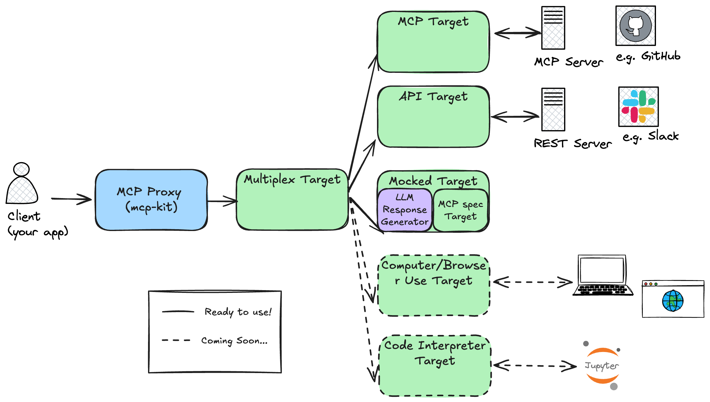

# Introduction

Welcome to MCP Kit, a powerful Python SDK developing and optimizing multi-agent AI systems.

## What is MCP Kit?

MCP Kit provides a comprehensive set of tools for:

- **Creating MCP Servers**: Build custom MCP servers from heterogeneous sources with ease
- **Client Integration**: Connect to existing MCP servers from your applications
- **Proxy Configurations**: Set up sophisticated routing and mocking strategies
- **Adapter Support**: Integrate with popular frameworks like OpenAI, LangGraph, and more

## Key Features

### 🔧 **Factory Pattern**
Create MCP components using a clean factory pattern with configuration files.

### 🎯 **Target System**
Flexible target system supporting:
- MCP servers
- OpenAPI/Swagger endpoints
- Mocked responses for testing
- Multiplexed routing

Coming soon:
- File system based
- Computer/Browser use
- Code interpreter
- Web search

### 🔌 **Framework Adapters**
Ready-to-use adapters for:
- OpenAI Agents SDK
- LangGraph
- Generic client sessions

### 🎲 **Response Generators**
Built-in generators for:
- LLM-powered responses
- Random/mock data
- Custom generation logic

## Quick Start

### Installation

```bash
uv add mcp-kit
```

#### Extras

If using with langgraph

```bash
uv add mcp-kit[langgraph]
```


### Basic Usage

#### First you write the Proxy config:

```yaml
# proxy_config.yaml
""" A mocked REST API target given the OpenAPI spec using LLM-generated responses
"""
target:
  type: mocked
  base_target:
    type: oas
    name: base-oas-server
    spec_url: https://petstore3.swagger.io/api/v3/openapi.json
  response_generator:
    type: llm
    model: openai/gpt-4.1-nano
```

#### Don't forget to setup the LLM API KEY:

```bash
# .env
OPENAI_API_KEY="your_openai_key"
```

#### Then we can use it as any other MCP:


```python
# main.py
from mcp_kit import ProxyMCP


async def main():
    # Create proxy from configuration
    proxy = ProxyMCP.from_config("proxy_config.yaml")

    # Use with MCP client session adapter
    async with proxy.client_session_adapter() as session:
        tools = await session.list_tools()
        result = await session.call_tool("get_pet", {"pet_id": "777"})
        print(result)


if __name__ == "__main__":
    import asyncio

    asyncio.run(main())
```

## Architecture Overview

MCP Kit follows a modular architecture:



The diagram above illustrates the core components and extensibility points of MCP Kit, including targets, adapters, and response generators. This modular design allows you to easily plug in new integrations and customize behavior for your multi-agent workflows.

## Next Steps

- [Installation Guide](./installation.md) - Get up and running
- [Configuration](./configuration.md) - Learn about proxy configs
- [Adapters](./adapters.md) - Framework integrations
- [Examples](../examples/index.mdx) - Real-world usage examples
- [API Reference](../reference/index.md) - Complete API documentation
